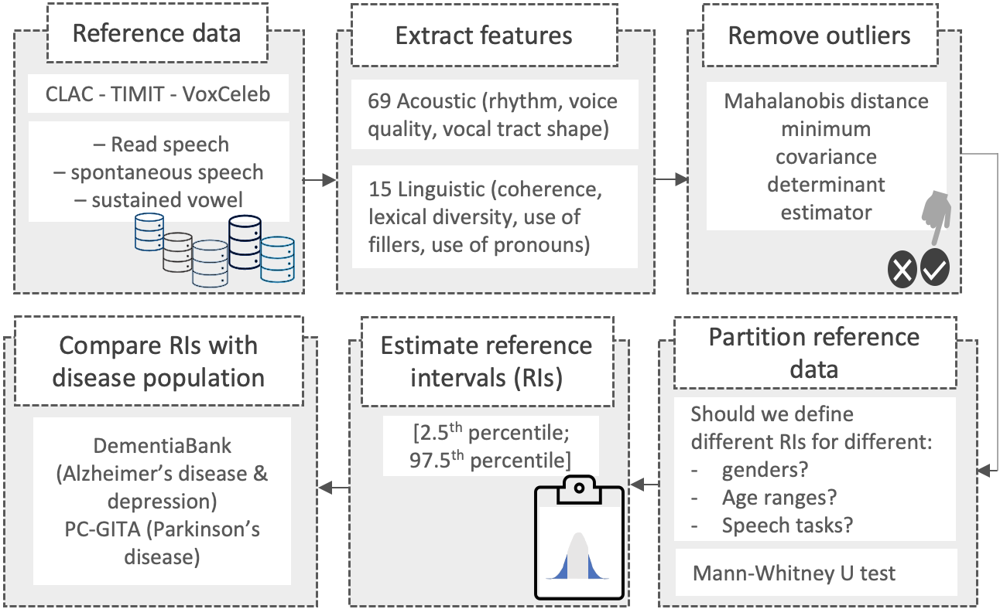

## Towards reference speech characterization for health applications

This is the official repository of the paper [Towards reference speech characterization for health applications](https://www.isca-speech.org/archive/pdfs/interspeech_2023/botelho23_interspeech.pdf), published at [Interspeech 2023](https://www.interspeech2023.org/), Dublin, Ireland, 20-24 August, 2023.

### Authors
- Catarina Botelho, INESC-ID/IST, University of Lisbon, Portugal; 
- Alberto Abad, INESC-ID/IST, University of Lisbon, Portugal; 
- Tanja Schultz, Cognitive Systems Lab, University of Bremen, Germany;
- Isabel Trancoso, INESC-ID/IST, University of Lisbon, Portugal.


### Abstract 
Speech has been used as a biomarker for the binary classification of multiple diseases, with promising results. However these speech affecting diseases often co-exist in the same individual and produce similar manifestations in the speech signal. Thus we propose to characterize normative speech using reference intervals for interpretable speech features (acoustic and linguistic), as a first step towards the adoption of speech analysis for multidisease screening in health applications. We discuss the impact of demographics and speech tasks. Finally, we compare the reference intervals with subjects suffering from Parkinson's disease, Alzheimer's disease and depression.


<p align="center"></p>
<p align="center"><b>Fig 1. Pipeline for characterizing refrence speech.</b></p>


### Code available [here](https://github.com/mcatarinatb/reference-speech-characterization/tree/main/ReferenceSpeech).


### How to cite

If you would like to cite our work, please use:
```
@inproceedings{botelho2023towards,
      title={Towards reference speech characterization for health applications}, 
      author={Botelho, Catarina and Abad, Alberto Schultz, Tanja and and Trancoso, Isabel},
      year={2023},
      month={August},
      address={Dublin, Ireland},
      booktitle={Interspeech},
}
```
### Acknowledgments
This work was funded by Portuguese national funds through Fundação para a Ciência e a Tecnologia, with references UIDB/50021/2020 and SFRH/BD/149126/2019, and by the Recovery and Resilience Plan and Next Generation EU European Funds, with reference C644865762-00000008 Accelerat.AI.
